# RevOS Skills

Public, version-controlled home of the [RevOS](https://revos.ai)
[Agent Skills](https://platform.claude.com/docs/en/agents-and-tools/agent-skills/overview).

Skills are grouped into **bundles** — one top-level directory per bundle, each a
plugin in the [`.claude-plugin/marketplace.json`](.claude-plugin/marketplace.json)
catalog. Install a whole bundle by pointing your tool at its directory.

## Bundles

### `data-engineering`

End-to-end RevOS data-engineering workflow. Installed by default when you scaffold
a project with `revos init`.

| Skill | What it does |
|---|---|
| [`create-connections`](data-engineering/skills/create-connections) | Author a RevOS Connection YAML to sync a Source into the warehouse. |
| [`load-sample-data`](data-engineering/skills/load-sample-data) | Populate a BigQuery dataset with sample data via `bq cp`. |
| [`explore-lakehouse`](data-engineering/skills/explore-lakehouse) | Inspect the BigQuery lakehouse — datasets, schemas, sample rows, null rates. |
| [`create-dbt-transformations`](data-engineering/skills/create-dbt-transformations) | Build dbt silver/gold models and declare raw sources. |
| [`create-cubes`](data-engineering/skills/create-cubes) | Generate Cube.dev cube definitions from dbt gold models. |
| [`query-semantic-model`](data-engineering/skills/query-semantic-model) | Run a Cube.js query and render the result inline as a table / chart. |
| [`visualize-semantic-model`](data-engineering/skills/visualize-semantic-model) | Render a `model-graph.png` of the cube relationships. |

### `platform`

Do in chat what you'd otherwise do in the RevOS app. Starts with querying your
live semantic model in plain English — more of the app's capabilities land here
over time. Connects your AI assistant to your org's RevOS data over MCP,
registered via [`.mcp.json`](platform/.mcp.json).

| Skill | What it does |
|---|---|
| [`query-semantic-model`](platform/skills/query-semantic-model) | Answer a business question by querying the org's semantic model over MCP and rendering the result inline as a table / chart. |

## Install

### skills.sh (`npx skills`)

[skills.sh](https://skills.sh) (the open `npx skills` tool) installs straight from
this GitHub repo. Point it at a **bundle directory** to install that whole bundle:

```bash
# Install the data-engineering bundle into the current project (.claude/skills/)
npx skills add revosai/skills/data-engineering --copy

# List the skills in a bundle without installing
npx skills add revosai/skills/data-engineering --list

# Target a specific agent / install globally / non-interactive
npx skills add revosai/skills/data-engineering -a claude-code -g --copy -y
```

`--copy` writes real files (committable, no symlinks). `-a` targets an agent
(`claude-code`, `cursor`, `opencode`, …), `-g` installs into your user dir, `-y`
skips prompts. Refresh later with `npx skills update`.

### Claude Code (plugin marketplace)

Each bundle is also a plugin in the `revos` marketplace:

```bash
/plugin marketplace add revosai/skills
/plugin install data-engineering@revos
```

### Cowork / claude.ai (plugin marketplace)

Claude chat and Cowork can install straight from this repo's plugin marketplace too, no CLI required:

1. Open **Customize** in the left sidebar (chat or Cowork).

   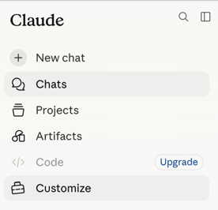

2. Under **Personal plugins** (or **Organization plugins**), click **+** — or **Browse plugins** if you don't have any yet.

   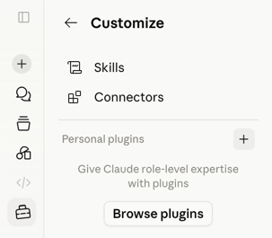

3. In the Directory, go to the **Plugins** tab, click **+** in the top right, and choose **Add from a repository**.

   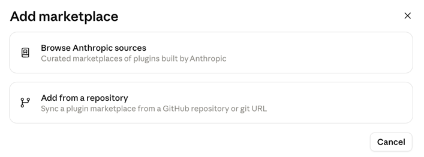

4. Enter `revosai/skills` in the **URL** field (or pick it from the dropdown) and click **Sync**.

   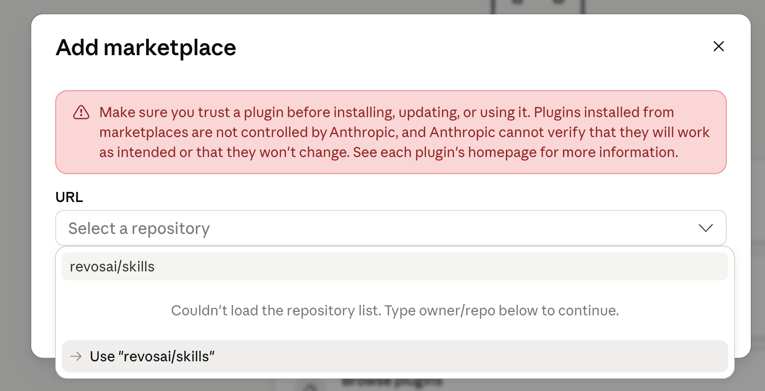

5. Switch to the **Personal** tab — you'll see the `skills` marketplace listing **RevOS Data Engineering** and **RevOS Platform**.

   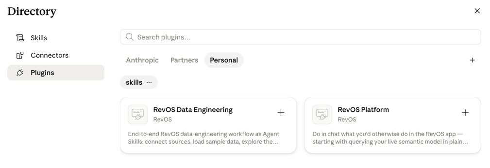

6. Click **+** on the plugin(s) you want to install. Once installed, the **+** turns into a **⚙️** you can click to open its settings.

   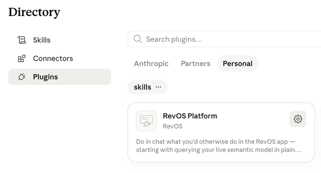

7. In the plugin's settings, the **Skills** tab lists the skills it added (e.g. `/query-semantic-model`).

   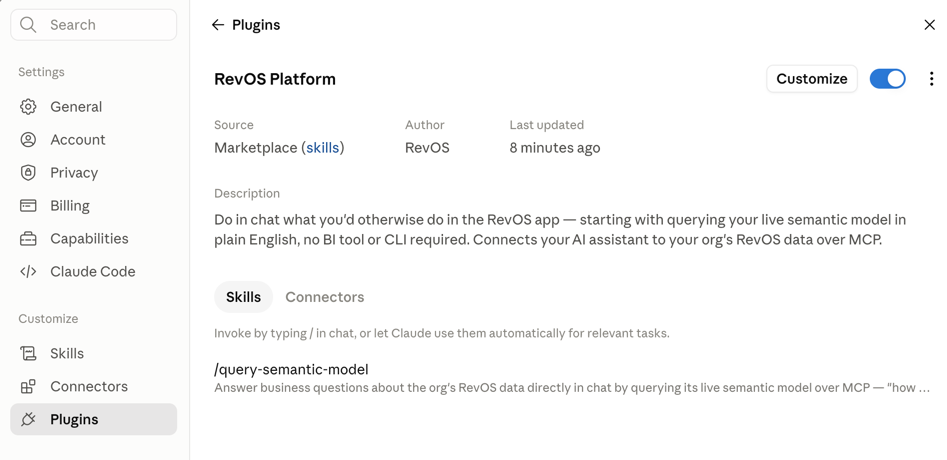

8. For `platform`, switch to the **Connectors** tab and click **Connect** to authorize the RevOS MCP connector — this step is required before the skill can actually query your data.

   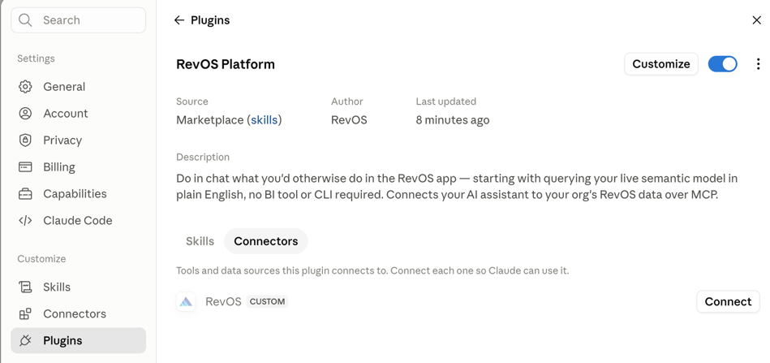

9. This opens RevOS's OAuth screen in your browser. Pick your organization from the dropdown and click **Allow**. You'll land back in Claude with a "Connected for RevOS" confirmation.

   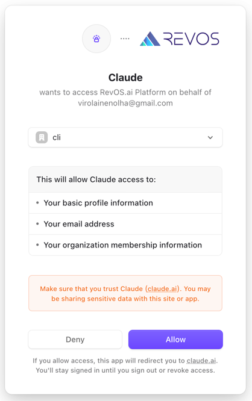

10. That's it — ask a business question in plain English and Claude queries your semantic model live:

    > Hi! Can you tell me which products are ordered most often?

    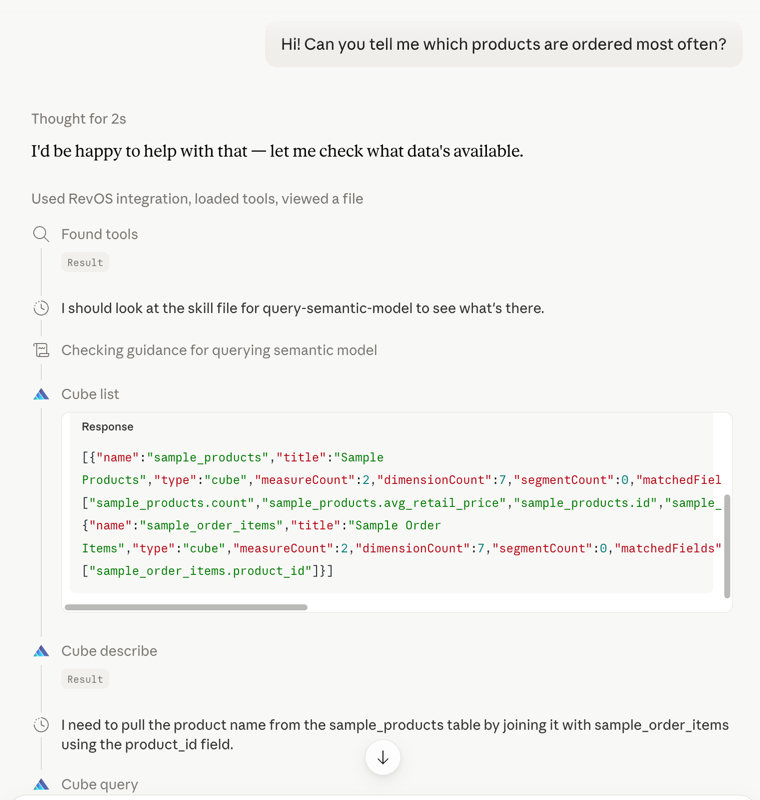
    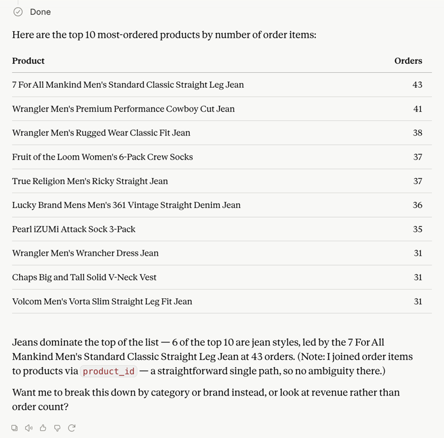

### `platform` — MCP connector

`platform` is aimed at business users, most of whom aren't in Claude Code at
all, so it installs differently — it registers an MCP server, not just skill
files, and `npx skills add` has no defined way to also register a plugin's
`.mcp.json`. Two paths:

**Claude Code plugin** — registers the MCP server and skill together; OAuth
against your RevOS org happens automatically on first tool call, no manual
token needed:

```bash
/plugin marketplace add revosai/skills
/plugin install platform@revos
```

**Claude.ai / ChatGPT connector (no Claude Code required)** — paste the MCP
URL directly into the app's connector settings (Claude.ai: Settings →
Connectors → Add custom connector; ChatGPT: Connectors → Add MCP server):

```
https://api.revos.ai/mcp
```

OAuth happens automatically in-browser the first time a tool is called — no
manual token, no CLI, no local files. This path has no skill attached, so the
assistant relies on the tool descriptions alone; expect a thinner experience
than the plugin path (no chart-rendering convention, no join-ambiguity
guidance).

### Manual

Each skill is a self-contained folder under its bundle's `skills/` directory
(e.g. [`data-engineering/skills/`](data-engineering/skills)) with a `SKILL.md`
(plus optional `references/` and `scripts/`). Copy a skill folder into the directory your agent
watches — e.g. `.claude/skills/<name>/` (project) or `~/.claude/skills/<name>/`
(global).

## Structure

```
.
├── .claude-plugin/
│   └── marketplace.json       # Claude Code marketplace manifest (one plugin per bundle)
└── <bundle>/                  # e.g. data-engineering/, platform/ (plugin `source`)
    ├── .mcp.json               # optional — MCP server(s) this bundle registers
    └── skills/                 # auto-discovered by Claude Code and skills.sh
        └── <skill-name>/
            ├── SKILL.md        # YAML frontmatter (name, description) + instructions
            ├── references/     # optional, loaded on demand
            └── scripts/        # optional executables
```

To add a new bundle: create a top-level `<bundle>/skills/` directory of skill folders
and add a matching plugin entry (with `source` pointing at the bundle) to `marketplace.json`.

## License

[MIT](LICENSE)
